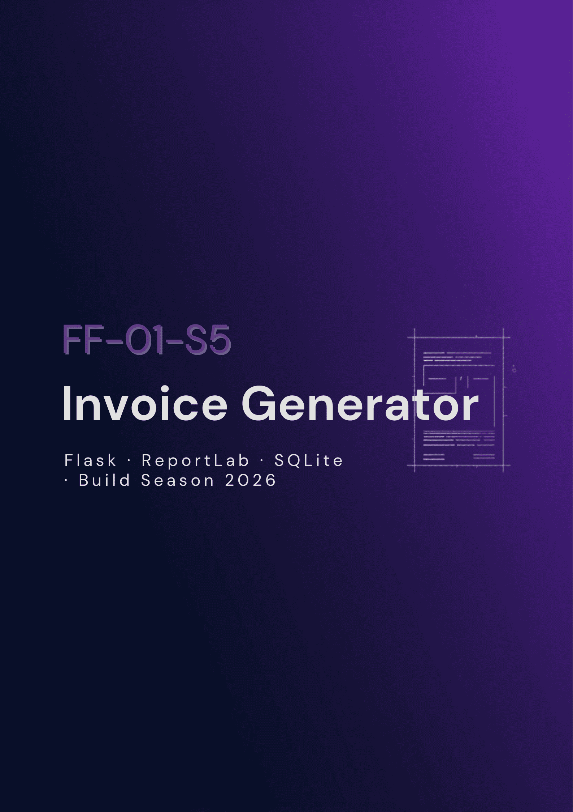
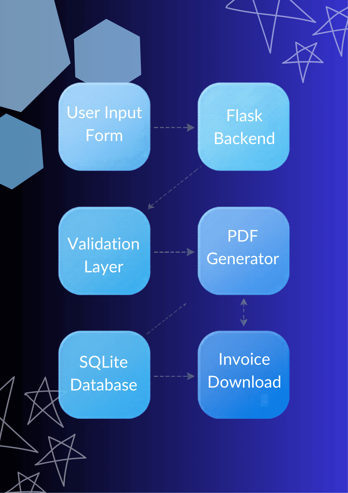
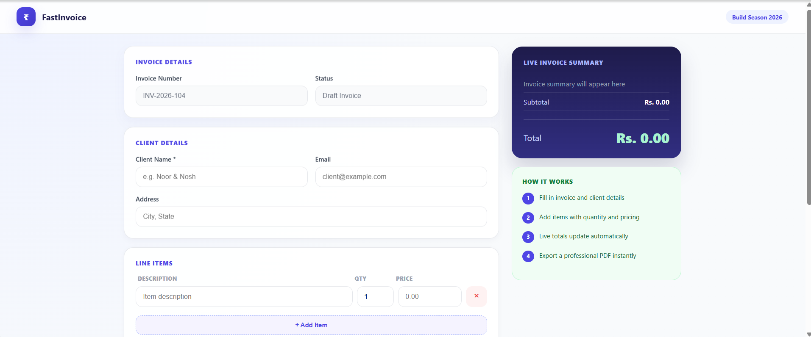
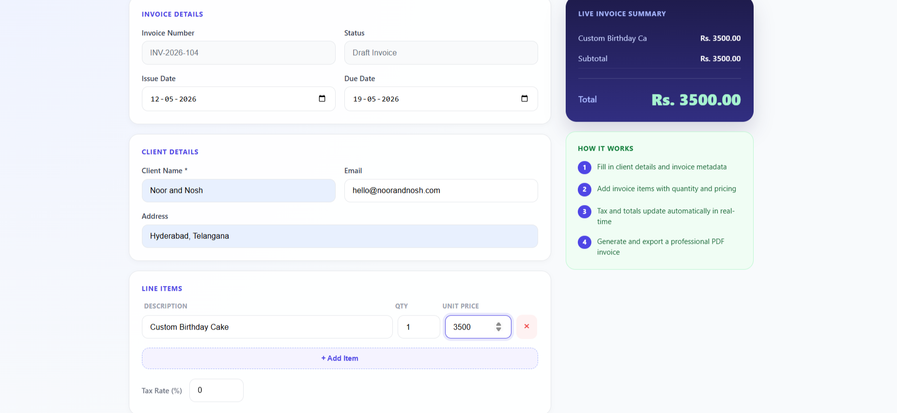
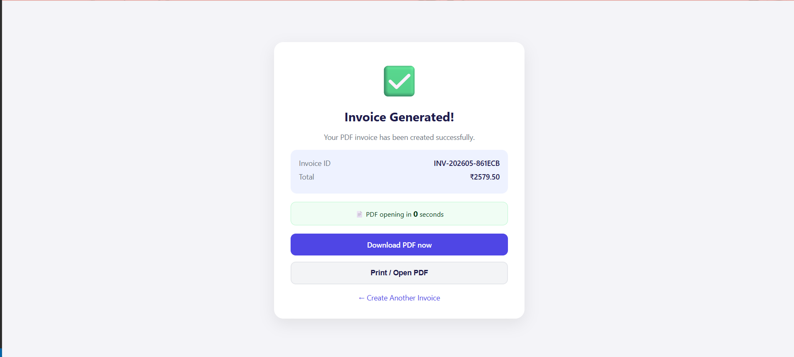

<div align="center">



<br/>


<br/>

# FF-01-S5 — Automated Invoice Generator

**Professional invoices in seconds — built for the micro-businesses that keep our cities running.**

*Team Fast & Curious · Stanley College of Engineering and Technology, Hyderabad · First-Year AI & ML*

</div>

---

## Team

| Name | Role |
|------|------|
| **Yusra Fatima** | Team Lead |
| **Maimuna Afrah** | Full-Stack Developer |
| **Samreen Fatima** | Research & Documentation |

---

## Product Overview

**FF-01-S5** is a lightweight, offline-first web application engineered for small businesses, freelancers, home bakeries, and independent vendors who need professional billing infrastructure — without the cost or complexity of enterprise software.

Users enter client details, append line items dynamically, and receive a formatted, print-ready PDF invoice instantly. Everything runs locally; no cloud account, no subscription, no friction.

### The Problem

Millions of grassroots micro-enterprises manage accounts through handwritten logs or fragmented WhatsApp messages. Standard billing platforms are either cost-prohibitive, structurally complex, or entirely dependent on connectivity. The result:

- **Operational Inefficiency** — Hours lost to manual document generation
- **Financial Risk** — Calculation errors that silently leak revenue
- **Poor Record-Keeping** — Scattered files, lost payment histories, tax chaos
- **Credibility Loss** — Hand-drafted receipts that undermine professional trust

### Real-World Inspiration

This project was built for a real user. **Noor & Nosh**, a home bakery connected to our team, was tracking every invoice in a notebook — manually totalling orders, recalculating tax, and hoping nothing got lost. We built FF-01-S5 to solve exactly that.

---

## UN SDG Alignment

<table>
<tr>
<td width="50%">

**Goal 8 — Decent Work & Economic Growth**

FF-01-S5 formalizes the operational backbone of micro-enterprises. By eliminating billing bottlenecks, it scales productivity and protects transaction integrity at the community level — directly enabling informal workers to operate with the professionalism of larger businesses.

</td>
<td width="50%">

**Goal 9 — Industry, Innovation & Infrastructure**

Built entirely on open-source tools, this project demonstrates how local industries can implement resilient digital infrastructure without heavy capital investment. Lightweight, portable, and deployable on any device with Python installed.

</td>
</tr>
</table>

---

## Key Features

| Feature | Description |
|:--------|:------------|
| Dynamic Invoice Staging | Add, edit, or remove line items instantly — no page reloads |
| Live Ledger Engine | Subtotal, custom tax, and grand total recalculate as you type |
| PDF Compositor | Clean, structured invoice layout generated via ReportLab |
| Zero-Click Delivery | Automatic download triggered immediately after form validation |
| Print Utility | Direct-to-print engine on the success portal |
| Local Storage | Full invoice history persisted in SQLite — works fully offline |
| 3-Layer Validation | Input checked at client, route controller, and schema level |

---

## Tech Stack

| Layer | Technology | Purpose |
|:------|:-----------|:--------|
| Backend | Python 3 / Flask | Routing, validation, core processing |
| Frontend | HTML5 / CSS3 / Vanilla JS | Responsive UI and live client-side calculation |
| PDF Engine | ReportLab | Document layout and PDF generation |
| Database | SQLite | Persistent local invoice history |
| Version Control | Git / GitHub | Codebase management and versioning |

---

## System Architecture

<div align="center">



</div>

Data flows from the **User Input Form** → **Flask Backend** → **Validation Layer**. On passing validation, the **PDF Generator** composes the invoice document, which is simultaneously written to the **SQLite Database** and streamed to **Invoice Download**.

---

## Application Screenshots

### Invoice Form
A two-column layout with a fixed live-preview panel on the right. Totals update in real time as items are added.

<div align="center">

</div>

<br/>

### Live Calculation in Action
Real-time pricing engine running an order payload for the Noor & Nosh bakery workflow.

<div align="center">

</div>

<br/>

### Invoice Generated Successfully
After validation, the system logs the invoice to the database and triggers an automatic PDF download.

<div align="center">

</div>

---

## Demo

> 📽️ [Watch the Demo Video](https://youtu.be/UHEL7MeZhIY)


---

## Installation Guide

### Prerequisites
- Python 3.8+ installed
- `pip` package manager
- Git

### Step 1 — Clone the Repository
```bash
git clone https://github.com/maimunaafrah341-maker/FF-01-S5.git
cd FF-01-S5
```

### Step 2 — Install Dependencies
```bash
pip install -r requirements.txt
```

### Step 3 — Run the Application
```bash
python app.py
```

### Step 4 — Open in Browser
```
http://localhost:5000
```

---

## Project Structure

```
FF-01-S5/
│
├── app.py              # Flask application — routes and validation
├── generator.py        # ReportLab PDF compositor
├── database.py         # SQLite schema and query logic
├── requirements.txt    # Dependency list
│
├── templates/
│   ├── index.html      # Invoice form UI
│   ├── success.html    # Post-generation success portal
│   └── history.html    # Invoice history view
│
└── screenshots/        # UI gallery images
```

---

## Future Roadmap

- GST-ready invoice formatting for Indian compliance
- Email invoice directly to client
- Razorpay / UPI payment link integration
- Cloud database option for multi-device sync
- Dashboard analytics and revenue summaries
- Multi-template invoice themes
- Authentication system for multi-user access

---

<div align="center">

Built with intent during **Build Season EPL '26** · Hosted by Code Crypt, Stanley College of Engineering

*Team Fast & Curious — First-Year AI & ML*

</div>
